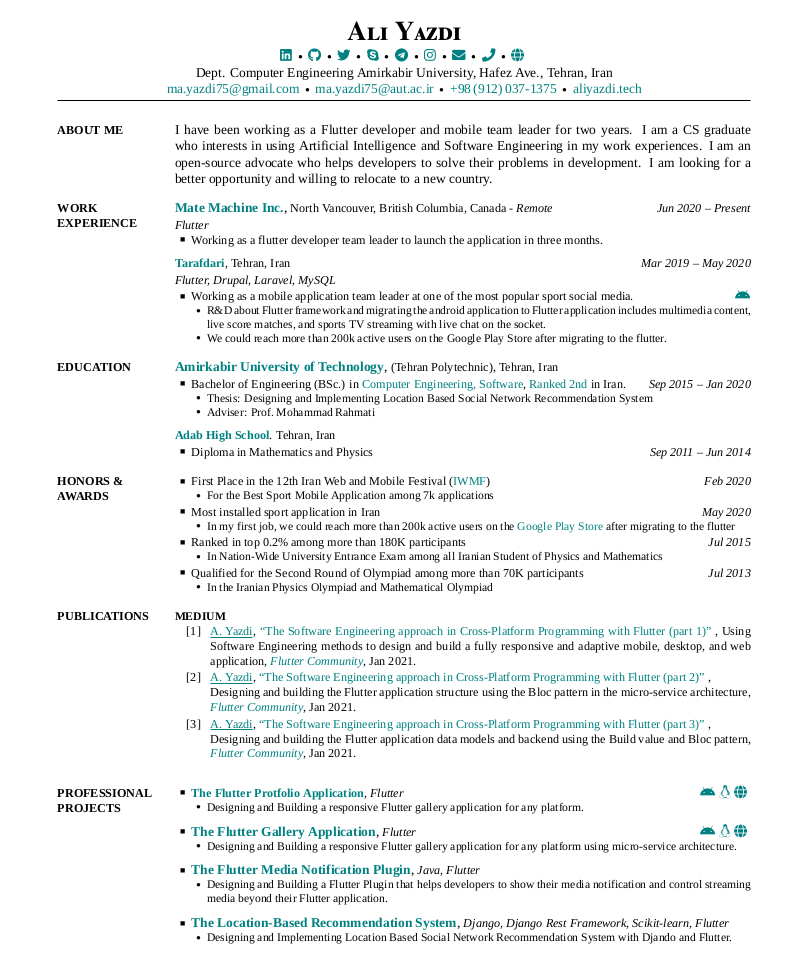
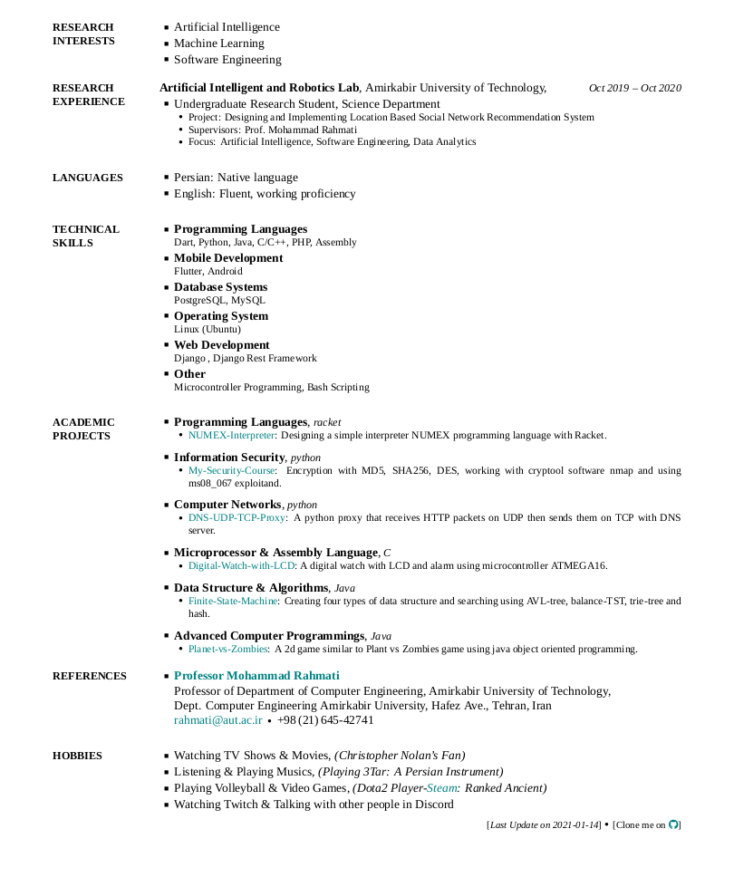

# Resume
My Resume using latex.

Please Star this repository if you think this might be helpful.

Make sure you have already installed Font-Awsome:

`apt install texlive-fonts-extra`

Cheatsheet for icons: [Link](https://github.com/sway/fontawesome-latex/blob/master/fontawesome.sty)

